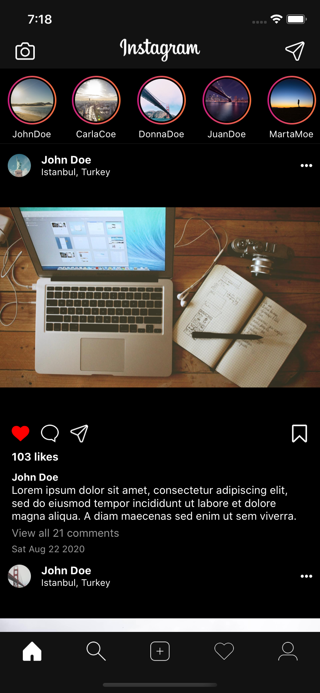
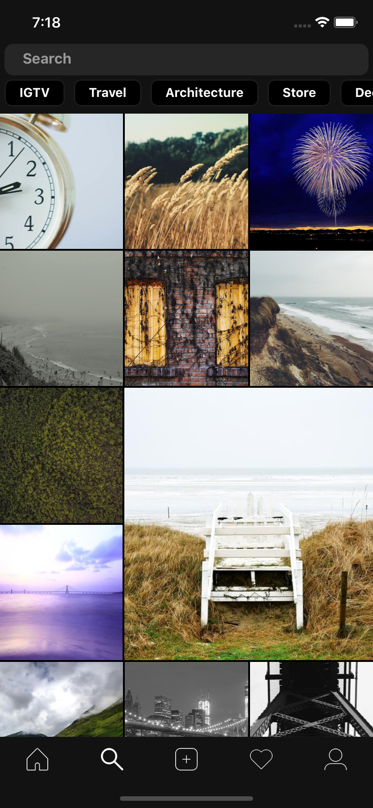
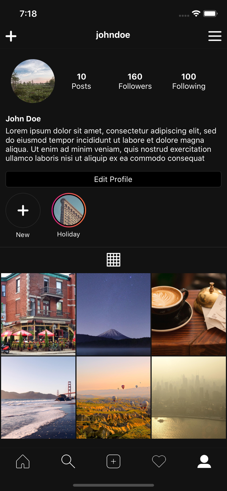
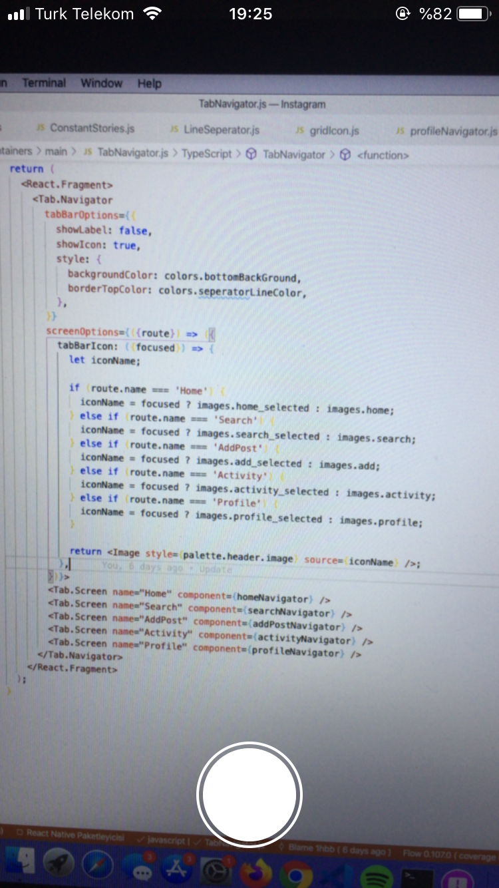

# React Native Instagram Clone
Instagram mobile app clone using React Native. I will add Activity screen and Add Pot screen in the future.

[](https://github.com/santosharron/instagram-clone)

<table>
  <tr>
    <td></td>
    <td></td>
  <tr>
  <tr>
    <td></td>
    <td></td>
  <tr>
  <tr>
    <td></td>
    <td></td>
  <tr>
</table>

<br />

### Installation

1. Clone the repo
   ```sh
   git clone https://github.com/santosharron/instagram-clone.git
   ```
2. Open Folder
   ```sh
   `cd Instagram`
   ```
3. Install Dependencies
   ```sh
   `npm install`
   `yarn install`
   ```
4. For (IOS Locate Ios Folder)
   ```sh
   `cd ios`
   ```
5. Then, retrieve the pods for the project
   ```sh
   `pod install`
   ```
6. Get Back
   ```sh
   `cd ..`
   ```
7. Run
   ```sh
   `react-native run-ios` or `react-native run-android`
   ```

## License

Distributed under the MIT License. See `LICENSE` for more information.


## Dependencies
- `@react-native-community/masked-view": "^0.1.10"`
- `@react-navigation/bottom-tabs": "^5.8.0"`
- `@react-navigation/native": "^5.7.3"`
- `@react-navigation/stack": "^5.9.0"`
- `react": "16.13.1"`
- `react-native": "0.63.2"`
- `react-native-camera": "^3.36.0"`
- `react-native-gesture-handler": "^1.7.0"`
- `react-native-linear-gradient": "^2.5.6"`
- `react-native-reanimated": "^1.10.2"`
- `react-native-safe-area-context": "^3.1.3"`
- `react-native-screens": "^2.10.1"`
- `react-native-webview": "^10.6.0"`
